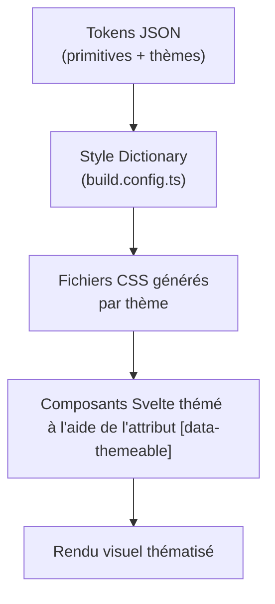

# Thématisation des composants

## Sommaire

- [Introduction](#introduction)
- [Architecture du système](#architecture-du-système)
- [Définition des tokens](#définition-des-tokens)
- [Génération des styles avec Style Dictionary](#génération-des-styles-avec-style-dictionary)
- [Intégration dans les composants Svelte](#intégration-dans-les-composants-svelte)
- [Mixins SCSS](#mixins-scss)
- [Visualisation dans Storybook](#visualisation-dans-storybook)
- [Scripts de build](#scripts-de-build)
- [Publication et CI/CD](#publication-et-cicd)
- [Guide : ajouter un nouveau thème](#guide--ajouter-un-nouveau-thème)
- [Composants thématisés](#composants-thématisés)

---

## Introduction

Le système de thématisation permet d'appliquer des identités visuelles distinctes aux composants développés dans ce projet.

Chaque produit du Lab ANSSI dispose de son propre thème :

| Thème              | Fichier de tokens |
| ------------------ | ----------------- |
| MonServiceSécurisé | `mss.json`        |
| MesServicesCyber   | `msc.json`        |
| MonAideCyber       | `mac.json`        |
| MonEspaceNIS2      | `nis2.json`       |

Le principe est le suivant :

1. Les composants s'appuient sur des variables CSS.\*\*\*\*
2. Ces variables CSS sont disponibles dans des fichiers `.css` générés à partir de fichiers `.json` de **design tokens**.
3. Le système de thématisation **surcharge ces variables** avec les couleurs propres à chaque produit, permettant ainsi aux composants de changer d'apparence sans modifier leur code source.

---

## Architecture du système de thématisation

```
src/tokens/
├── source/
│   ├── primitives.json              # Tokens de base partagés (couleurs, rayons, filtres)
│   └── themes/
│       ├── mac.json                 # Tokens du thème MonAideCyber
│       ├── msc.json                 # Tokens du thème MesServicesCyber
│       ├── mss.json                 # Tokens du thème MonServiceSécurisé
│       └── nis2.json                # Tokens du thème MonEspaceNIS2
├── build.config.ts                  # Configuration Style Dictionary
└── build/                           # Fichiers CSS générés (par thème)

src/lib/
├── utilitaires/index.ts             # Fonction setThemeable()
├── styles/
│   ├── mixins.scss                  # Mixins SCSS (border-radius, checkbox, etc.) permettant certaines adaptations du code
│   └── dsfr-variables.scss          # Fichier contenant les imports SCSS des variables DSFR
└── composants/                      # Composants Svelte du Lab
└── dsfr/                            # Composants Svelte DSFR

.storybook/
└── lab-anssi-themes.css             # Fichier combiné de tous les thèmes générés
```

Le workflow global est le suivant :



---

## Définition des tokens

### Primitives (`primitives.json`)

Les primitives constituent le socle de valeurs partagé par tous les thèmes.<br/> Elles ne sont pas directement exposées en CSS mais servent de références aux tokens de thème.

Elles incluent :

- Des palettes de couleurs (`blue`, `gold`, `purple`, `navy`, `indigo`, `gray`, `dark`)
- Des rayons de bordure (`none`, `xs`, `sm`, `md`, `lg`)
- Des filtres CSS pour la colorisation d'icônes
- Des fonds spéciaux (ex. motifs SVG)

### Tokens de thème (`themes/*.json`)

Chaque fichier de thème définit deux catégories de tokens :

#### 1. Tokens applicatifs (`:root`)

Ce sont des tokens propres à chaque produit. Ils sont générés dans le sélecteur `:root`.

```json
{
  "centre-aide": {
    "$type": "color",
    "background": {
      "bouton": { "$value": "{color.gold.500}" }
    }
  },
  "bouton": {
    "primaire": {
      "couleur-fond": { "$value": "{yellow-msc.200}" }
    }
  }
}
```

#### 2. Tokens DSFR thématisables (`[data-themeable]`)

Ces tokens surchargent les variables CSS du DSFR.<br/> Ils sont identifiés par la propriété `"$themeable": true` et sont générés dans le sélecteur `[data-themeable]`.

```json
{
  "background": {
    "action": {
      "high-blue-france": {
        "$type": "color",
        "$value": "{yellow-msc.200}",
        "$themeable": true
      }
    }
  },
  "text": {
    "action-high-blue-france": {
      "$type": "color",
      "$value": "{midnight-blue-msc.950}",
      "$themeable": true
    }
  }
}
```

Les catégories de variables DSFR surchargées sont :

| Catégorie    | Variables concernées                                                                                                                   |
| ------------ | -------------------------------------------------------------------------------------------------------------------------------------- |
| `artwork`    | `major-blue-france`, `minor-blue-france`, `decorative-blue-france`                                                                     |
| `background` | `alt-blue-france`, `action-high-blue-france`, `active-blue-france`, `open-blue-france`, `flat-blue-france-lab`, `contrast-blue-france` |
| `border`     | `default-blue-france`, `action-high-blue-france`, `active-blue-france`, `open-blue-france`, `plain-blue-france`                        |
| `text`       | `title-blue-france`, `action-high-blue-france`, `inverted-blue-france`, `active-blue-france`, `marianne`                               |

> Les noms des variables conservent la nomenclature `blue-france` du DSFR, même si les couleurs effectives sont différentes (jaune pour MSC, bleu pour MSS, etc.). Cela assure la compatibilité avec les composants DSFR sans nécessiter de modification de leur code source.

---

## Génération des styles avec Style Dictionary

La transformation des tokens JSON en variables CSS est assurée par [Style Dictionary](https://amzn.github.io/style-dictionary/) via le fichier `src/tokens/build.config.ts`.

### Format personnalisé : `css/theme-root`

Ce format sépare les tokens générés en deux blocs CSS :

- Les tokens **sans** `$themeable` sont placés dans le sélecteur `:root`
- Les tokens **avec** `$themeable: true` sont placés dans le sélecteur `[data-themeable]`

```css
/* Exemple de sortie pour le thème MSC */
:root {
  --yellow-msc-200: #fed980;
  --bouton-primaire-couleur-fond: var(--yellow-msc-200);
}

[data-themeable] {
  --background-action-high-blue-france: var(--yellow-msc-200);
  --text-action-high-blue-france: var(--midnight-blue-msc-950);
}
```

Les références internes au thème sont préservées sous forme de `var(...)` (ex. `var(--yellow-msc-200)`), tandis que les références aux primitives sont résolues en valeurs brutes.<br/> Cela assure le principe DRY : une seule source de vérité pour chaque couleur.

### Action personnalisée : `concateneTousLesThemes`

Après la génération de chaque fichier de thème individuel, cette action :

1. Remplace `:root` par `.theme-{CIGLE-DU-THEME}` (ex. `.theme-msc`)
2. Remplace `[data-themeable]` par `.theme-{CIGLE-DU-THEME} [data-themeable]`
3. Concatène le résultat dans `.storybook/lab-anssi-themes.css`

Ce fichier combiné permet le basculement de thèmes dans Storybook via des classes CSS.

### Fichiers générés

| Fichier                                     | Usage                       |
| ------------------------------------------- | --------------------------- |
| `src/tokens/build/lab-anssi-theme.msc.css`  | Thème MSC (production)      |
| `src/tokens/build/lab-anssi-theme.mss.css`  | Thème MSS (production)      |
| `src/tokens/build/lab-anssi-theme.mac.css`  | Thème MAC (production)      |
| `src/tokens/build/lab-anssi-theme.nis2.css` | Thème NIS2 (production)     |
| `.storybook/lab-anssi-themes.css`           | Tous les thèmes (Storybook) |

---

## Intégration dans les composants Svelte

### La fonction `setThemeable`

Définie dans `src/lib/utilitaires/index.ts`, cette fonction marque un Web Component comme thématisable.

Elle ajoute l'attribut `data-themeable="true"` sur l'élément hôte du Web Component.<br/> Cet attribut est clé dans ce système : les variables CSS thématisées ne s'appliquent qu'aux éléments portant cet attribut (via le sélecteur `[data-themeable]`).

### Usage dans un composant

```svelte
<script lang="ts">
  import { setThemeable } from "$lib/utilitaires";

  setThemeable($host());
</script>
```

L'appel à `setThemeable($host())` se fait dans la section `<script>` du composant.<br/>
`$host()` est [une API Svelte](https://svelte.dev/docs/svelte/host) qui retourne l'élément hôte du Custom Element.

---

## Mixins SCSS

Le fichier `src/lib/styles/mixins.scss` fournit des mixins dédiés à la thématisation.

### `set-border-radius`

Applique un rayon de bordure contrôlé par la variable CSS `--lab-border-radius`, avec une valeur de repli.

```scss
@mixin set-border-radius($radius: 0) {
  border-radius: var(--lab-border-radius, #{$radius});
}
```

Chaque thème peut définir `--lab-border-radius` pour appliquer des coins arrondis (ou non) globalement.

### `set-icon-check`

Reproduit une coche (checkmark) en pur CSS via des bordures.<br/> Cela remplace les icônes SVG embarquées du DSFR, qui ne sont pas thématisables par variables CSS.

```scss
@mixin set-icon-check($icon-color: var(--border-action-high-blue-france)) {
  border-left: 2px solid $icon-color;
  border-bottom: 2px solid $icon-color;
  content: "";
  display: inline-block;
  height: 10px;
  transform: rotate(-45deg) translate(1px, -1px) scale(0.7);
  width: 16px;
}
```

### `set-themeable-checkbox`

Masque l'icône SVG par défaut des cases à cocher DSFR et la remplace par la coche CSS thématisable.

```scss
@mixin set-themeable-checkbox() {
  input[type="checkbox"]:checked + label {
    &::before {
      --data-uri-svg: none; /* Masque l'icône DSFR */
    }
    &::after {
      @include set-icon-check(var(--text-inverted-blue-france));
    }
  }
}
```

---

## Visualisation dans Storybook

Storybook est configuré pour permettre le basculement entre les thèmes via un sélecteur dans la barre d'outils.

### Configuration (`.storybook/preview.ts`)

```typescript
import { withThemeByClassName } from "@storybook/addon-themes";
import "./lab-anssi-themes.css";

decorators: [
  withThemeByClassName({
    themes: {
      MonServiceSécurisé: "theme-mss",
      MesServicesCyber: "theme-msc",
      MonAideCyber: "theme-mac",
      MonEspaceNIS2: "theme-nis2",
      DSFR: "theme-dsfr",
    },
    defaultTheme: "MonServiceSécurisé",
  }),
];
```

### Fonctionnement

1. L'utilisateur sélectionne un thème dans la barre d'outils Storybook
2. L'addon applique la classe correspondante (ex. `theme-msc`) sur le conteneur
3. Les variables CSS du thème sélectionné sont appliquées en cascade
4. Les composants avec `[data-themeable]` reçoivent les surcharges DSFR

---

## Scripts de build

### `build:tokens`

```bash
pnpm run build:tokens
```

Exécute Style Dictionary (`src/tokens/build.config.ts`) pour générer les fichiers CSS de chaque thème, puis formate le fichier combiné Storybook avec Prettier.

### `build:styles:dsfr`

```bash
pnpm run build:styles:dsfr
```

Compile les variables DSFR de base depuis `src/lib/styles/dsfr-variables.scss` vers `dist/assets/dsfr-variables.css`.<br/> Ce fichier fournit les valeurs par défaut des variables DSFR que les thèmes viennent surcharger.

---

## Publication et CI/CD

Le workflow GitHub Actions (`.github/workflows/publication-npm.yml`) intègre la thématisation dans le processus de publication :

1. Build des styles DSFR : `pnpm run build:styles:dsfr`
2. Build des tokens : `pnpm run build:tokens`
3. Copie des fichiers CSS générés dans `dist/assets/`
4. Publication du package sur NPM
5. Envoi des assets (tokens CSS + variables DSFR) vers le CDN (S3)

Les consommateurs du package peuvent récupérer les fichiers de thème :

- Via NPM : dans le dossier `dist/assets/` du package
- Via le CDN : fichiers CSS accessibles publiquement

---

## Guide : ajouter un nouveau thème

### 1. Créer le fichier de tokens

Créer un fichier `src/tokens/source/themes/{CIGLE-DU-THEME}.json` en suivant la structure des thèmes existants :

```json
{
  "couleur-primaire": {
    "$type": "color",
    "500": { "$value": "#..." }
  },
  "background": {
    "action": {
      "high-blue-france": {
        "$type": "color",
        "$value": "{couleur-primaire.500}",
        "$themeable": true
      }
    }
  }
}
```

Les tokens marqués `"$themeable": true` surchargeront les variables DSFR correspondantes.

### 2. Générer les fichiers CSS

```bash
pnpm run build:tokens
```

Un fichier `src/tokens/build/lab-anssi-theme.{CIGLE-DU-THEME}.css` sera généré automatiquement _(mais non versionné)_, et le fichier Storybook sera mis à jour.

### 3. Ajouter le thème dans Storybook

Dans `.storybook/preview.ts`, ajouter le nouveau thème au décorateur :

```typescript
themes: {
  // ... thèmes existants
  NouveauProduit: "theme-{CIGLE-DU-THEME}",
},
```

---

## Utilisation dans un projet

Pour utiliser les composants thématisés dans une page HTML, trois ressources sont nécessaires :

1. **Les variables DSFR** (`dsfr-variables.css`) - Fournit les valeurs par défaut des variables CSS du DSFR[^1]
2. **Un fichier de thème** (`lab-anssi-theme.{CIGLE-DU-THEME}.css`) - Surcharge les variables avec les couleurs du thème choisi
3. **Le script de la librairie** (`lab-anssi-ui-kit.iife.js`) - Enregistre les Web Components

### Exemple complet

```html
<!doctype html>
<html lang="fr">
  <head>
    <meta charset="UTF-8" />
    <meta name="viewport" content="width=device-width, initial-scale=1.0" />
    <title>Mon application</title>

    <!-- 1. Variables DSFR (valeurs par défaut) -->
    <link
      href="https://lab-anssi-ui-kit-prod-s3-assets.cellar-c2.services.clever-cloud.com/1.41.1/dsfr-variables.css"
      rel="stylesheet"
    />

    <!-- 2. Thème souhaité (ici MonServiceSécurisé) -->
    <link
      href="https://lab-anssi-ui-kit-prod-s3-assets.cellar-c2.services.clever-cloud.com/1.41.1/lab-anssi-theme.mss.css"
      rel="stylesheet"
    />
  </head>
  <body>
    <dsfr-button>Ceci est un bouton !</dsfr-button>

    <!-- 3. Script de la librairie -->
    <script src="./lab-anssi-ui-kit.iife.js"></script>
  </body>
</html>
```

### Changer de thème

Pour appliquer un thème différent, il suffit de remplacer la feuille de style du thème :

```html
<!-- MonServiceSécurisé -->
<link href=".../lab-anssi-theme.mss.css" rel="stylesheet" />

<!-- MesServicesCyber -->
<link href=".../lab-anssi-theme.msc.css" rel="stylesheet" />

<!-- MonAideCyber -->
<link href=".../lab-anssi-theme.mac.css" rel="stylesheet" />

<!-- MonEspaceNIS2 -->
<link href=".../lab-anssi-theme.nis2.css" rel="stylesheet" />
```

### Ressources disponibles sur le CDN

Les assets sont publiés sur le CDN à l'adresse suivante :

```text
https://lab-anssi-ui-kit-prod-s3-assets.cellar-c2.services.clever-cloud.com/{version}/{nom-du-fichier}.css
```

Les fichiers disponibles selon cette syntaxe sont les suivants :

| Fichier                    | Description                  |
| -------------------------- | ---------------------------- |
| `dsfr-variables.css`       | Variables **DSFR**           |
| `lab-anssi-theme.mss.css`  | Thème **MonServiceSécurisé** |
| `lab-anssi-theme.msc.css`  | Thème **MesServicesCyber**   |
| `lab-anssi-theme.mac.css`  | Thème **MonAideCyber**       |
| `lab-anssi-theme.nis2.css` | Thème **MonEspaceNIS2**      |

> L'ordre de chargement est important : `dsfr-variables.css` doit être chargé **avant** le fichier de thème, afin que les surcharges du thème s'appliquent correctement.

---

[^1]: Ce fichier est nécessaire uniquement si on souhaite utiliser des composants du DSFR. Dans le cas contraire, l'utilisation de ce fichier est facultative.
